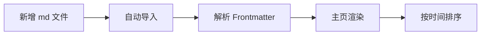

# 2026-04-05 更新日志

本次更新聚焦于官网文档系统建设。

## 新增内容

### 1. 文档分页系统

官网首页新增文档中心区域，支持在同一页面中浏览多篇文档，并通过左侧分页列表快速切换。

### 2. Markdown 自动引入

现在只需要将 `.md` 文件放入 `src/docs` 目录，系统就会自动：

- 读取文档内容
- 解析 Frontmatter
- 生成标题与摘要
- 接入主页文档列表
- 自动按时间排序

### 3. 富文本渲染支持

文档中心现已支持：

- Markdown
- LaTeX 数学公式
- Mermaid 图表
- 表格、引用、代码块等常见结构

### 4. 基础文档预置

为了避免文档中心初始为空，预置了快速开始与更新日志总览文档。

---

## 示例公式

$$
\beta = \sigma(L \cdot \log(1+R) - S \cdot noise\_penalty)
$$

---

## 示例流程图

---

## 后续建议

接下来建议按两条线持续维护：

1. **教学文档线**：用于介绍 VCP 架构、能力、使用方式
2. **更新日志线**：用于持续记录版本迭代与修复内容

这样官网既能承载说明文档，也能作为项目演进记录中心。