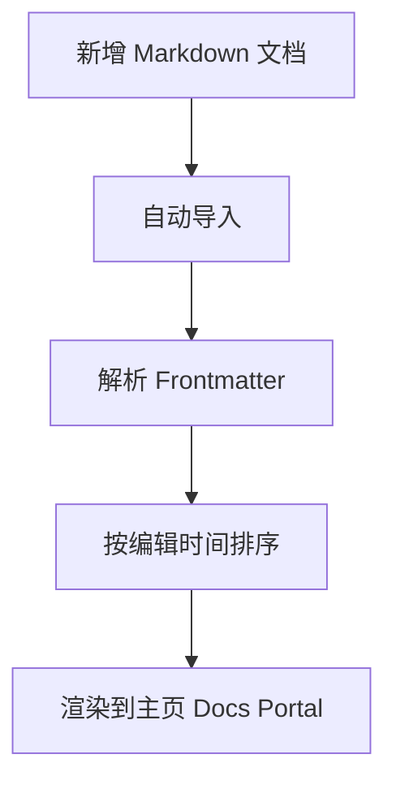

# 快速开始

欢迎来到 VCP 官网文档中心。

这里的文档采用 **自动导入** 机制：只要你把新的 Markdown 文件放到 `src/docs` 目录中，主页就会自动显示一条新的文档分页卡片，并按最近编辑时间自动排序。

---

## 文档能力一览

当前文档中心支持以下能力：

- GitHub Flavored Markdown
- 数学公式（LaTeX）
- Mermaid 图表
- 表格、引用、代码块
- 自动标题、摘要与更新时间展示

---

## 如何新增文档

只需要添加一个新的 `.md` 文件，例如：

```bash
src/docs/my-update-log.md
```

推荐为每篇文档添加头部信息：

```md
---
title: 版本更新日志
summary: 记录每个阶段的重要功能迭代与修复内容。
updatedAt: 2026-04-05
---
```

其中：

| 字段 | 说明 |
| --- | --- |
| `title` | 文档显示标题 |
| `summary` | 文档卡片摘要 |
| `updatedAt` | 可选，展示用更新时间 |

如果没有写这些字段，系统也会尽量自动回退生成。

---

## 数学公式示例

行内公式示例：$E = mc^2$

块级公式示例：

$$
\tau_m \frac{dV}{dt} = -(V - V_{rest}) + R \cdot I(t)
$$

---

## Mermaid 示例



---

## 推荐写作方式

建议把文档按以下类型组织：

1. 更新日志
2. 教学文档
3. 架构说明
4. 使用手册
5. FAQ

这样可以让主页文档中心持续扩展，但仍然保持结构清晰。

> 提示：如果你只是想快速记事，直接新建 Markdown 文件即可，系统会自动引入。