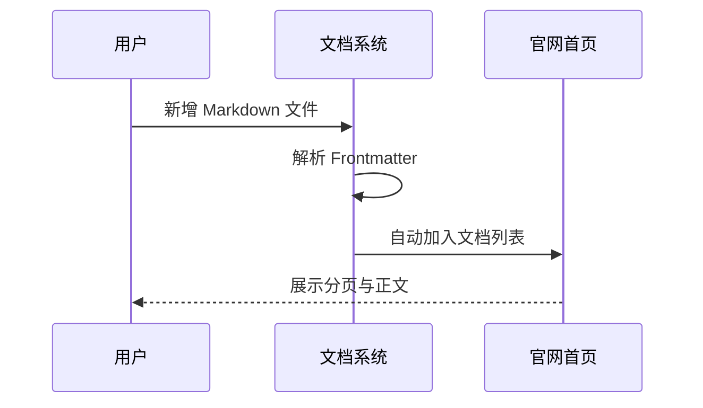

# 教学文档编写指南

这是一篇面向教程内容的示例文档，用于说明官网文档中心适合承载什么类型的内容。

---

## 适合写什么

教学型文档适合包括：

- 快速开始
- 安装部署
- 架构解读
- 术语说明
- 使用教程
- 最佳实践
- 常见问题

---

## 推荐结构

建议一篇教学文档包含以下几个部分：

1. 这篇文档解决什么问题
2. 前置条件是什么
3. 具体步骤怎么做
4. 常见错误有哪些
5. 最后的总结与扩展阅读

---

## 表格示例

| 类型 | 用途 | 建议 |
| --- | --- | --- |
| `guide` | 教程、说明、入门 | 推荐用于长期维护 |
| `changelog` | 版本更新日志 | 推荐独立归档 |
| `note` | 临时记录 | 可快速补充 |

---

## 代码示例

```ts
export function bootstrapDocs() {
  return "docs-ready";
}
```

---

## 图表示例



---

## 公式示例

$$
Score = \frac{Relevance \times Freshness}{Noise + 1}
$$

---

## 写作建议

> 教学文档不需要一次写得特别完整，但最好每篇只讲清楚一个主题。

这样官网文档中心会越来越清晰，也更适合后续持续沉淀内容。